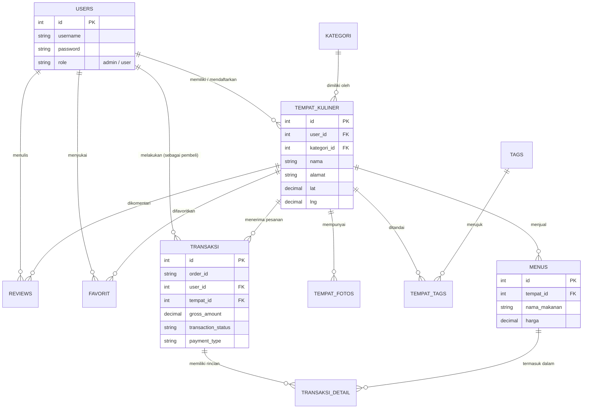

# Sistem Informasi Geografis (SIG) Kuliner Kampus
**Mata Kuliah: Pemrograman Web Lanjut (CodeIgniter 4)**

Proyek ini adalah aplikasi pemetaan tempat kuliner (UMKM) berbasis CodeIgniter 4. Aplikasi ini memungkinkan pengguna untuk melihat rekomendasi kuliner, memesan makanan secara online (E-Commerce), melakukan pembayaran *real-time* via Midtrans, serta mengekspos RESTful API untuk kebutuhan eksternal.

---

## 🎯 Pencapaian Fitur Berdasarkan Kriteria Penilaian

Sistem ini dirancang untuk memenuhi **Nilai Sempurna (Sangat Baik / 85-100)** pada seluruh kriteria penilaian:

1. **Perencanaan & Desain Database:** Database telah dinormalisasi hingga bentuk 3NF. Seluruh relasi terbangun dengan baik (One-to-Many & Many-to-Many).
2. **Migration & Seeder:** Skema database sepenuhnya dikelola melalui Migration CI4. Terdapat *Seeder* yang realistis (`TempatKulinerSeeder`, `UserSeeder`, dll).
3. **Autentikasi & Otorisasi:** Menggunakan sistem *Session*, Multi-Role (Admin & Kontributor), dilengkapi dengan `AuthFilter` dan `RoleFilter` untuk memproteksi seluruh *routes*.
4. **CRUD Utama:** Fitur CRUD lengkap untuk Kategori, Tag, Tempat Kuliner, dan Menu dengan validasi input, *flash message*, dan *upload file* gambar.
5. **Webservice Client:** Aplikasi mengonsumsi API Eksternal (Nominatim OpenStreetMap) untuk *Geocoding* dan *Reverse Geocoding*, lengkap dengan sistem *Caching* bawaan CI4 dan *Error Handling*.
6. **Webservice Server (API Endpoint):** Aplikasi mengekspos RESTful API (GET, POST, PUT, DELETE) di *route* `/api/kuliner`, diproteksi menggunakan **API Key** via `ApiAuthFilter`. Dokumentasi API tersedia di `/api/docs`.
7. **Payment Gateway & Notifikasi:** Terintegrasi penuh dengan Midtrans (Snap Pop-up & Webhook Callback). Sistem juga memicu pengiriman notifikasi Email ketika pembayaran dinyatakan "Lunas" (Settlement).
8. **UI/UX & Layout:** Menggunakan template profesional (NiceAdmin) dengan layout yang responsif, rapi, modern, dan konsisten di seluruh halaman.
9. **Kualitas Kode:** Menerapkan arsitektur MVC (Model-View-Controller) yang ketat. Kodingan bersih dan terorganisir dengan komentar penjelas.
10. **GitHub & Dokumentasi:** Repositori GitHub memiliki lebih dari 10+ *commit* berkala dengan penamaan yang bermakna. README disertakan beserta Panduan Instalasi dan Desain ERD.

---

## 💾 Panduan Instalasi (Cara Install)

Berikut adalah langkah-langkah untuk menjalankan aplikasi ini di komputer lokal (Localhost):

1. **Clone Repository**
   Buka terminal/CMD dan jalankan:
   ```bash
   git clone https://github.com/adianto25/PWL.git
   cd PWL
   ```

2. **Install Dependencies**
   Pastikan Anda sudah menginstall [Composer](https://getcomposer.org/). Jalankan:
   ```bash
   composer install
   ```

3. **Konfigurasi Environment (.env)**
   - Gandakan/ubah nama file `env` bawaan CI4 menjadi `.env`.
   - Buka file `.env` dan atur mode environment:
     ```env
     CI_ENVIRONMENT = development
     ```
   - Atur koneksi database Anda:
     ```env
     database.default.hostname = localhost
     database.default.database = db_nanang
     database.default.username = root
     database.default.password = 
     database.default.DBDriver = MySQLi
     ```
   - (Opsional) Atur *ServerKey* dan *ClientKey* Midtrans jika ingin menguji pembayaran.

4. **Migrasi Database & Seeding**
   Buat database kosong bernama `db_nanang` di phpMyAdmin, kemudian jalankan perintah ini di terminal untuk merancang otomatis tabel-tabelnya beserta data palsu (dummy):
   ```bash
   php spark migrate
   php spark db:seed MainSeeder
   ```
   *(Catatan: Anda juga bisa mengimpor file SQL manual jika tersedia).*

5. **Jalankan Aplikasi**
   Setelah semua siap, jalankan *development server*:
   ```bash
   php spark serve
   ```
   Aplikasi dapat diakses melalui browser di: **http://localhost:8080**

---

## 📊 Entity Relationship Diagram (ERD)

Struktur relasi antar tabel (Database Normalization 3NF) dalam sistem ini:



---

*Dibuat untuk memenuhi Tugas Akhir / Proyek Mata Kuliah Pemrograman Web Lanjut.*
