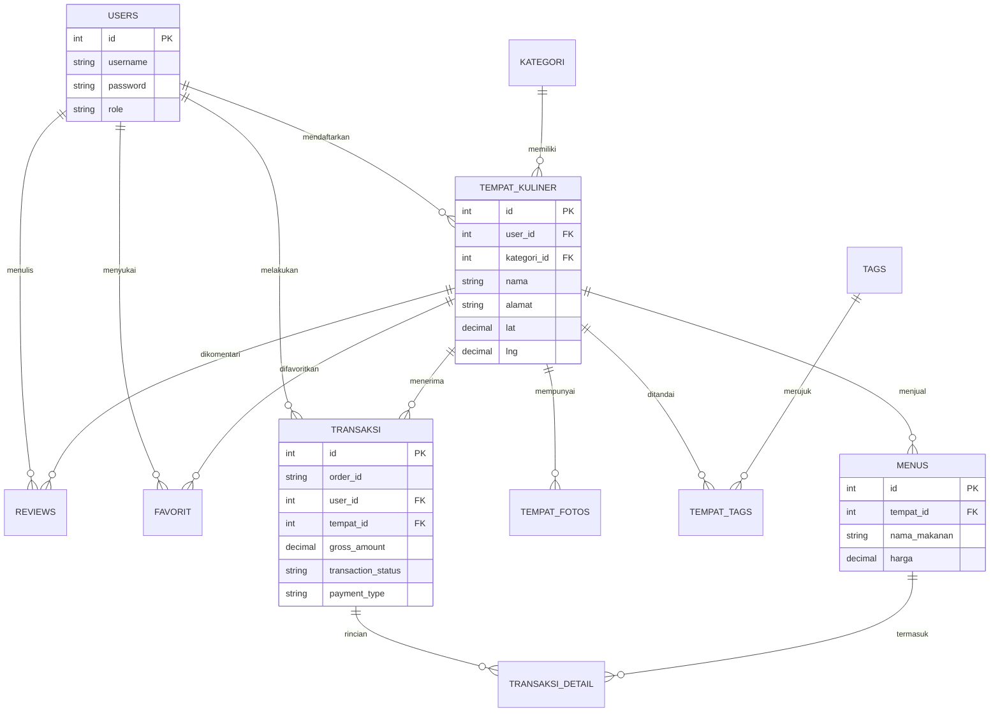
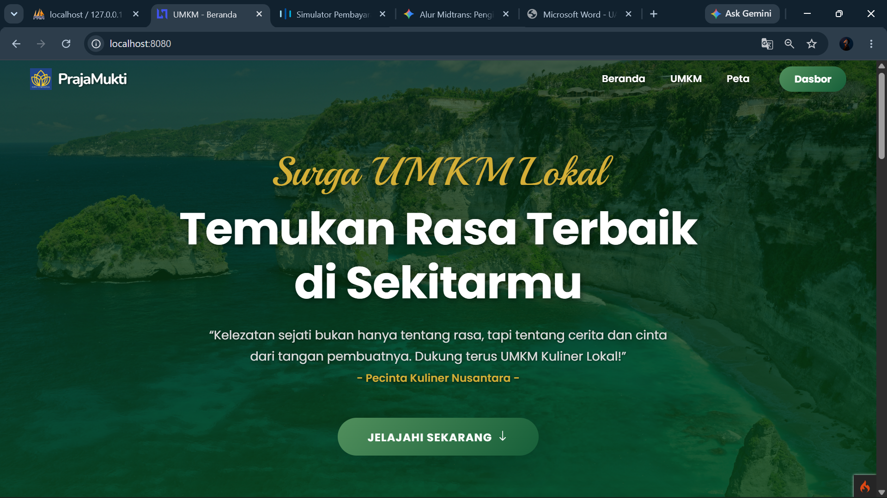
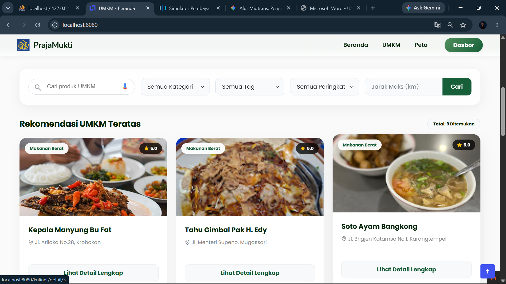
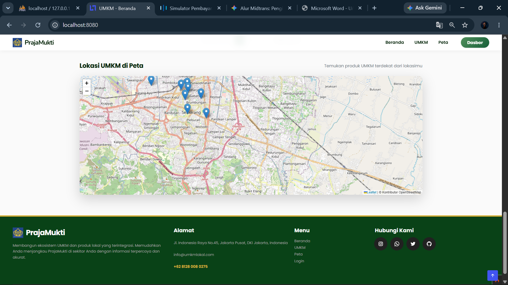
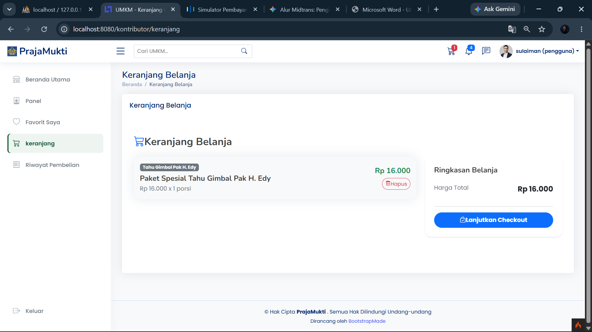
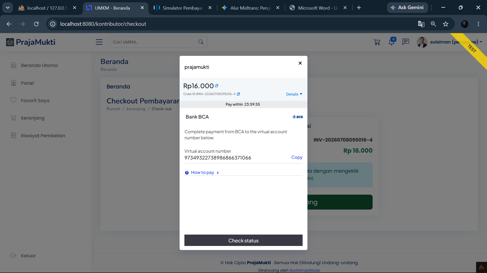
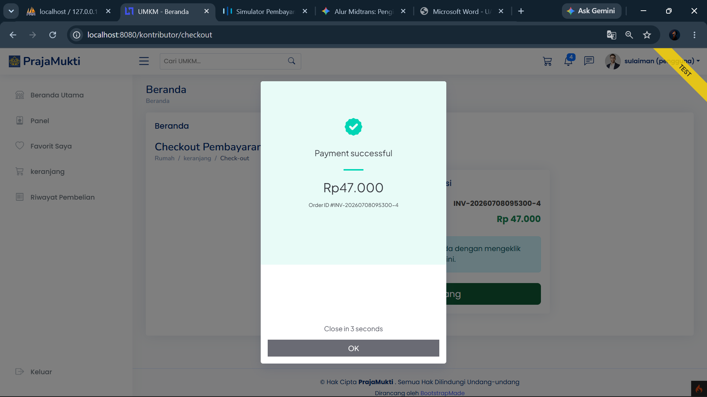
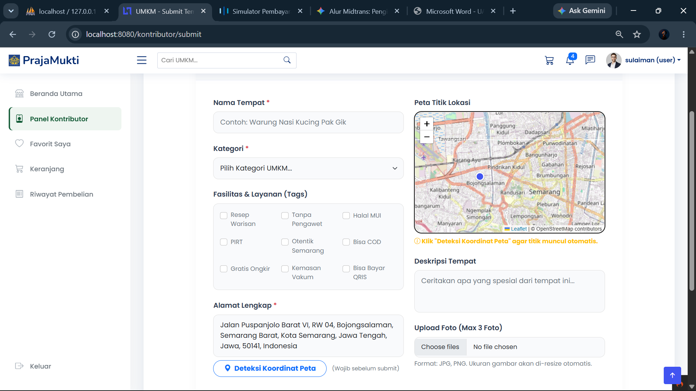

# Sistem Informasi Geografis (SIG) Kuliner Kampus
**Mata Kuliah: Pemrograman Web Lanjut (CodeIgniter 4)**

Proyek ini adalah aplikasi pemetaan tempat kuliner (UMKM) berbasis CodeIgniter 4. Aplikasi ini memungkinkan pengguna untuk melihat rekomendasi kuliner, memesan makanan secara online (E-Commerce), melakukan pembayaran *real-time* via Midtrans, serta mengekspos RESTful API untuk kebutuhan eksternal.

---

## 🎯 Pencapaian Fitur Berdasarkan Kriteria Penilaian

Sistem ini dirancang untuk memenuhi **Nilai Sempurna (Sangat Baik / 85-100)** pada seluruh kriteria penilaian:

1. **Perencanaan & Desain Database:** Database telah dinormalisasi hingga bentuk 3NF. Seluruh relasi terbangun dengan baik (One-to-Many & Many-to-Many).
2. **Migration & Seeder:** Skema database sepenuhnya dikelola melalui Migration CI4. Terdapat *Seeder* yang realistis (`TempatKulinerSeeder`, `UserSeeder`, dll).
3. **Autentikasi & Otorisasi:** Menggunakan sistem *Session*, Multi-Role (Admin & Kontributor), dilengkapi dengan `AuthFilter` dan `RoleFilter` untuk memproteksi seluruh *routes*.
4. **CRUD Utama:** Fitur CRUD lengkap untuk Kategori, Tag, Tempat Kuliner, dan Menu dengan validasi input, *flash message*, dan *upload file* gambar.
5. **Webservice Client:** Aplikasi mengonsumsi API Eksternal (Nominatim OpenStreetMap) untuk *Geocoding* dan *Reverse Geocoding*, lengkap dengan sistem *Caching* bawaan CI4 dan *Error Handling*.
6. **Webservice Server (API Endpoint):** Aplikasi mengekspos RESTful API (GET, POST, PUT, DELETE) di *route* `/api/kuliner`, diproteksi menggunakan **API Key** via `ApiAuthFilter`. Dokumentasi API tersedia di `/api/docs`.
7. **Payment Gateway & Notifikasi:** Terintegrasi penuh dengan Midtrans (Snap Pop-up & Webhook Callback). Sistem juga memicu pengiriman notifikasi Email ketika pembayaran dinyatakan "Lunas" (Settlement).
8. **UI/UX & Layout:** Menggunakan template profesional (NiceAdmin) dengan layout yang responsif, rapi, modern, dan konsisten di seluruh halaman.
9. **Kualitas Kode:** Menerapkan arsitektur MVC (Model-View-Controller) yang ketat. Kodingan bersih dan terorganisir dengan komentar penjelas.
10. **GitHub & Dokumentasi:** Repositori GitHub memiliki lebih dari 10+ *commit* berkala dengan penamaan yang bermakna. README disertakan beserta Panduan Instalasi dan Desain ERD.

---

## 💾 Panduan Instalasi (Cara Install)

Berikut adalah langkah-langkah untuk menjalankan aplikasi ini di komputer lokal (Localhost):

1. **Clone Repository**
   Buka terminal/CMD dan jalankan:
   ```bash
   git clone https://github.com/adianto25/PWL.git
   cd PWL
   ```

2. **Install Dependencies**
   Pastikan Anda sudah menginstall [Composer](https://getcomposer.org/). Jalankan:
   ```bash
   composer install
   ```

3. **Konfigurasi Environment (.env)**
   - Gandakan/ubah nama file `.env.example` bawaan menjadi `.env`.
   - Buka file `.env` dan atur mode environment:
     ```env
     CI_ENVIRONMENT = development
     ```
   - Atur koneksi database Anda:
     ```env
     database.default.hostname = localhost
     database.default.database = db_nanang
     database.default.username = root
     database.default.password = 
     database.default.DBDriver = MySQLi
     ```
   - (Opsional) Atur *ServerKey* dan *ClientKey* Midtrans jika ingin menguji pembayaran.

4. **Migrasi Database & Seeding**
   Buat database kosong bernama `db_nanang` di phpMyAdmin.
   Berdasarkan standar CodeIgniter 4, *migration* dan *seeder* dijalankan dengan dua perintah berikut secara berurutan (ekuivalen dengan `php spark migrate --seed` di framework lain):
   ```bash
   php spark migrate
   php spark db:seed MainSeeder
   ```

5. **Jalankan Aplikasi**
   Setelah semua siap, jalankan *development server*:
   ```bash
   php spark serve
   ```
   Aplikasi dapat diakses melalui browser di: **http://localhost:8080**

---

## 🔐 Akun Demo

Untuk memudahkan pengujian (sesuai spesifikasi project), berikut adalah akun demo yang dapat digunakan:

| Role | Username / Email | Password | Keterangan |
| :--- | :--- | :--- | :--- |
| **Admin** | admin | 123456 | Memiliki akses penuh ke panel admin, moderasi, dan data transaksi keseluruhan. |
| **User/Kontributor** | nanang | 123456 | Dapat memesan makanan (checkout), melihat riwayat pembelian, dan mendaftarkan UMKM. |
| **User/Kontributor** | rudi | 123456 | Akun kontributor alternatif. |

---

## 📸 Screenshot Fitur Utama

Berikut adalah gambaran fitur-fitur utama di dalam aplikasi:

1. **Halaman Beranda & Peta Kuliner**
   Menampilkan daftar tempat kuliner dengan peta interaktif terintegrasi Leaflet.js.
   *(Tambahkan screenshot beranda di sini)*
   
2. **Detail & Pemesanan Makanan (Keranjang)**
   Pengguna dapat melihat detail UMKM, menu makanan, dan menambahkannya ke keranjang.
   *(Tambahkan screenshot keranjang/detail di sini)*

3. **Checkout & Midtrans Payment Gateway**
   Proses pembayaran E-Commerce menggunakan pop-up Midtrans (Sandbox).
   *(Tambahkan screenshot midtrans di sini)*

4. **Dashboard Admin**
   Manajemen tempat kuliner, kategori, tag, dan data transaksi seluruh pengguna.
   *(Tambahkan screenshot admin di sini)*

---

## 📊 Entity Relationship Diagram (ERD)

Struktur relasi antar tabel (Database Normalization 3NF) dalam sistem ini:



---
## hasil demo fitur utama



Dari ketiga gambar diatas merupakan tampilan awal dari halaman website ini

Pada gambar diatas merupakan tampilan dari user telah melakukan checkout dan akan masuk ke dalam keranjang

Pada gambar diatas merupakan tampilan ketika user akan melakukan pembayaran maka akan menampilkan popup pilihan untuk membayar menggunakan pembayarn apa

Pada gambar diatas merupakan tampilan ketika user sudah berhasil melakukan pembayaran


Gambar berikut menunjukkan fitur pencarian lokasi yang mendukung dua arah (two-way conversion), yaitu:
Reverse Geocoding: Ketika pengguna mengklik suatu titik pada peta, sistem secara otomatis mengambil koordinat (latitude dan longitude) kemudian mengubahnya menjadi alamat yang sesuai. Alamat tersebut akan langsung ditampilkan pada kolom alamat.
Forward Geocoding: Sebaliknya, ketika pengguna memasukkan alamat pada kolom pencarian, sistem akan mencari koordinat (latitude dan longitude) dari alamat tersebut. Setelah koordinat diperoleh, marker akan berpindah ke lokasi yang sesuai pada peta.
*Dibuat untuk memenuhi Tugas Akhir / Proyek Mata Kuliah Pemrograman Web Lanjut.*
